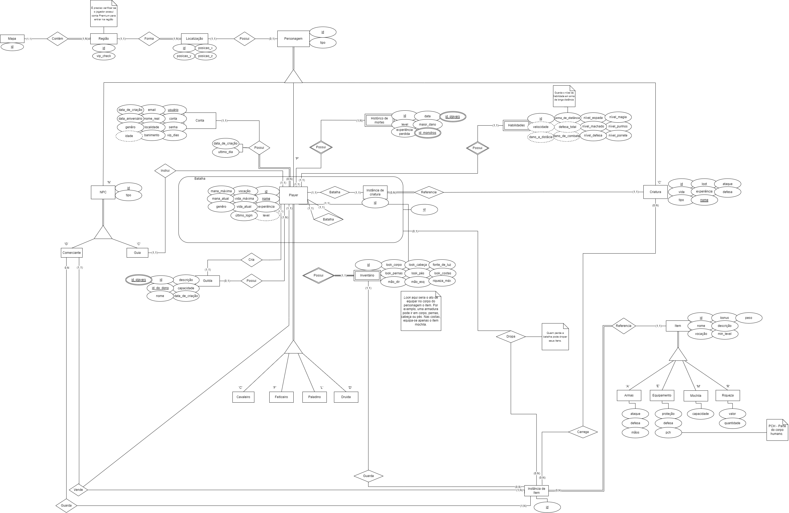

## Histórico de revisão

| Data       | Versão | Alteração            | Autor                                     |
| ---------- | ------ | -------------------- | ----------------------------------------- |
| 03/07/2022 | 0.1    | Criação do documento | [João Durso](https://github.com/jvsdurso),  [Tomás Veloso](https://github.com/tomasvelos0), [Laís Ramos](https://github.com/laisramos123) |
| 04/07/2022 | 0.2    | Adição do MER v1.0   | [João Durso](https://github.com/jvsdurso),  [Tomás Veloso](https://github.com/tomasvelos0), [Laís Ramos](https://github.com/laisramos123)|

## Modelo Entidade-Relacionamento

O MER (Modelo Entidade-Relacionamento) é utilizado para descrever os objetos do mundo real através de **entidades**, que possuem **atributos** e **relacionamentos** para descrever suas propriedades e, desssa forma, representar os aspectos estáticos do Domínio da Aplicação.

O DER (Diagrama Entidade-Relacionamento) é utilizado para representar em forma gráfica o que foi descrito no MER (Modelo Entidade Relacionamento).

## Diagrama Entidade-Relacionamento

## Versões Anteriores

Clique para apresentar a versão 1.0 do DER

### DER v1.0

Como o Diagrama Entidade-Relacionamento foi feito no [Google Drive](https://drive.google.com/file/d/1guPJuix8kxib0uT8hAv54tWpBJPTuFqz/view?usp=sharing), através da plataforma Diagrams(draw.io), não teve como restaurar todo o histórico de modificações. Portanto, somente as mudanças a partir da versão 1.0 serão documentadas.

**Autor(es):** [João Durso](https://github.com/jvsdurso)   

