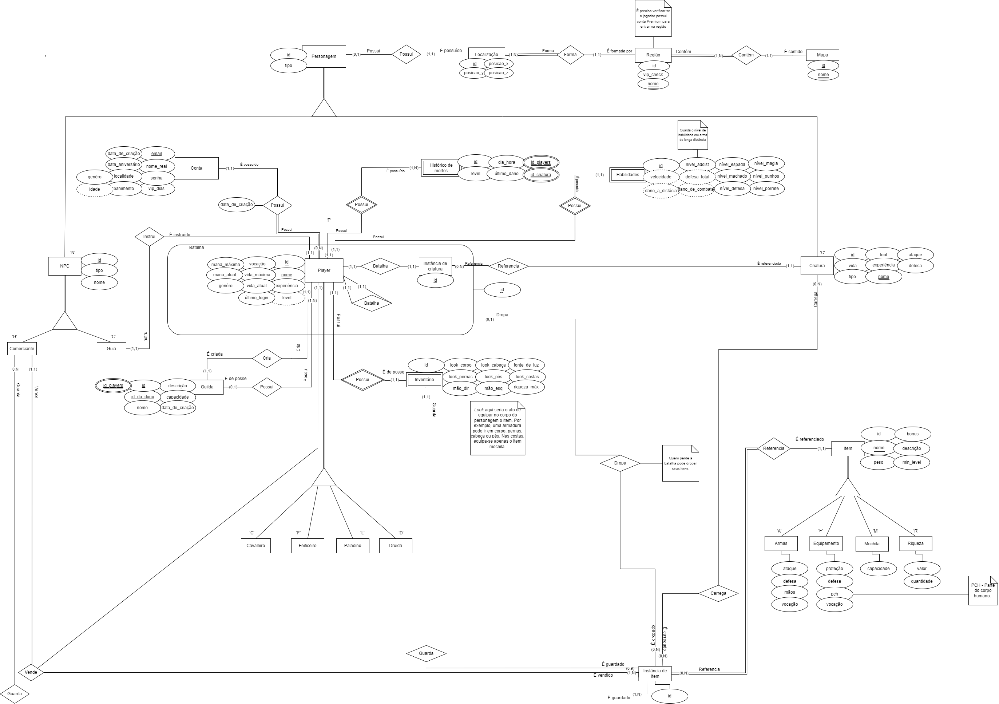
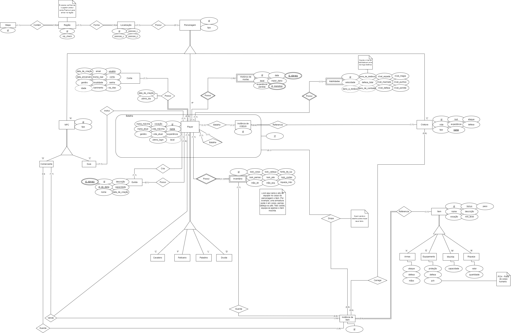

## Histórico de revisão

| Data       | Versão | Alteração                                                                               | Autor                                                                                                                                    |
| ---------- | ------ | --------------------------------------------------------------------------------------- | ---------------------------------------------------------------------------------------------------------------------------------------- |
| 03/07/2022 | 0.1    | Criação do documento                                                                    | [João Durso](https://github.com/jvsdurso), [Tomás Veloso](https://github.com/tomasvelos0), [Laís Ramos](https://github.com/laisramos123) |
| 04/07/2022 | 0.2    | Adição do MER v1.0                                                                      | [João Durso](https://github.com/jvsdurso), [Tomás Veloso](https://github.com/tomasvelos0), [Laís Ramos](https://github.com/laisramos123) |
| 31/07/2022 | 0.3    | Correção de erros gramaticais e aperfeiçoamento da disposição dos elementos do Diagrama | [João Durso](https://github.com/jvsdurso), [Laís Ramos](https://github.com/laisramos123)                                                 |
| 31/07/2022 | 0.4    | Adição das relações                                                                     | [Laís Ramos](https://github.com/laisramos123)                                                                                            |
| 02/08/2022 | 0.5    | Melhoria de documento                                                                   | [João Durso](https://github.com/jvsdurso), [Laís Ramos](https://github.com/laisramos123)                                                 |

## Modelo Entidade-Relacionamento

O MER (Modelo Entidade-Relacionamento) é utilizado para descrever os objetos do mundo real através de **entidades**, que possuem **atributos** e **relacionamentos** para descrever suas propriedades e, desssa forma, representar os aspectos estáticos do Domínio da Aplicação.

O DER (Diagrama Entidade-Relacionamento) é utilizado para representar em forma gráfica o que foi descrito no MER (Modelo Entidade Relacionamento).

## Diagrama Entidade-Relacionamento

## Versões Anteriores

Clique para apresentar a versão 1.0 do DER

 
### DER v1.0
 
Como o Diagrama Entidade-Relacionamento foi feito no [Google Drive](https://drive.google.com/file/d/1guPJuix8kxib0uT8hAv54tWpBJPTuFqz/view?usp=sharing), através da plataforma Diagrams(draw.io), não teve como restaurar todo o histórico de modificações. Portanto, somente as mudanças a partir da versão 1.0 serão documentadas.
 

 
**Autor(es):**  
[João Durso](https://github.com/jvsdurso)   

 

Clique para apresentar a versão 1.1 do DER

 
### DER v1.1
As modificações realizadas nesta versão foram:
- Mudar localização, região e mapa para a direita, para facilitar o entendimento do diagrama;
- Nome de criatura agora é chave candidata (único);
- Adição do atributo 'nome' em mapa, região e NPC;
- O email passa a ser chave primária de conta;
- ContaPossuiPlayer agora só possui o último acesso, que foi retirado de 'Player';
- Adição de 'level' em 'Player';
- Nome de player passa a ser chave primária de player;
- Player não possui mais capacidade, que foi atrelado ao inventário e às habilidades;
- Habilidade e Inventário não possui mais um id próprio, pois são entidades fraca. Agora a chave primária é o próprio 'Player' por meio de 'nomePlayer';
- Vocação não é mais um atributo genérico de Item;
- Correções gramaticais.
 
 

 
**Autor(es):**  
[João Durso](https://github.com/jvsdurso), [Lais Ramos](https://github.com/laisramos123)   

Clique para apresentar a versão 1.2 do DER

 
### DER v1.2
As modificações realizadas nesta versão foram:
- Adição de papéis para melhor entendimento do diagrama;
- Adição de detalhes visuais (dois traços embaixo) para definir chaves candidatas.
 
 

 
**Autor(es):**  
[João Durso](https://github.com/jvsdurso), [Lais Ramos](https://github.com/laisramos123)   

