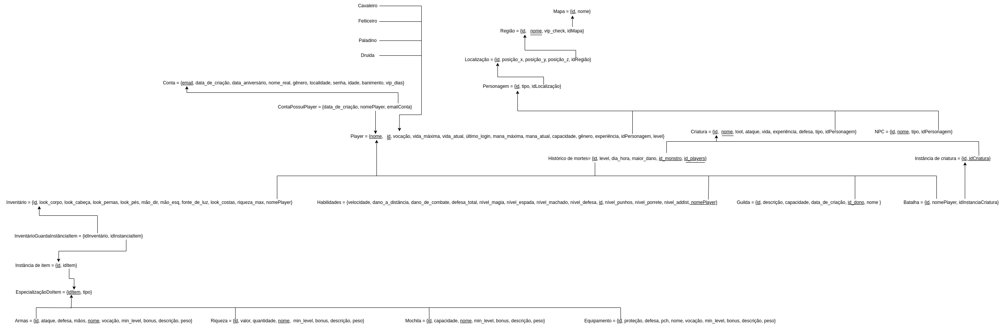

## Histórico de revisão
 
| Data       | Versão | Alteração            | Autor                                     |
| ---------- | ------ | -------------------- | ----------------------------------------- |
| 03/07/2022 | 0.1    | Criação do documento | [João Durso](https://github.com/jvsdurso),  [Tomás Veloso](https://github.com/tomasvelos0), [Laís Ramos](https://github.com/laisramos123) |
| 04/07/2022 | 0.2    | Adição do MREL v1.0  | [João Durso](https://github.com/jvsdurso),  [Tomás Veloso](https://github.com/tomasvelos0), [Laís Ramos](https://github.com/laisramos123) |
| 31/07/2022 | 0.3    | Adição dos papéis e correção de erros no MREL v3.0  | [João Durso](https://github.com/jvsdurso), [Laís Ramos](https://github.com/laisramos123) |
 
## Modelo Relacional
 
O MREL (Modelo Relacional) é utilizado para apoiar a implementação das aplicações, apresentando um projeto lógico de como as entidades e relacionamentos serão mapeadas no SGBD, porém é um modelo lógico não atrelado a algum SGBD específico.
 

 
## Versões Anteriores
 

Clique para apresentar a versão 1.0 do MREL

 
### MREL v1.0
 
Como o Modelo Relacional foi feito no [Google Drive](https://drive.google.com/file/d/116N7p4iBj1Jgl5VEohrv1pRYw0CqJupo/view?usp=sharing), através da plataforma Diagrams(draw.io), não teve como restaurar todo o histórico de modificações. Portanto, somente as mudanças a partir da versão 1.0 serão documentadas.
 

 
**Autor(es):**
[João Durso](https://github.com/jvsdurso)

Clique para apresentar a versão 2.0 do MREL

 
### MREL v2.0
Ao analisar a versão 2.0, percebemos que havia alguns erros a serem corrigidos e que faltava acrescentar os diferentes papéis possíveis para o Player.
 
 

 
**Autor(es):**
[João Durso](https://github.com/jvsdurso)
[Laís Ramos](https://github.com/laisramos123)

